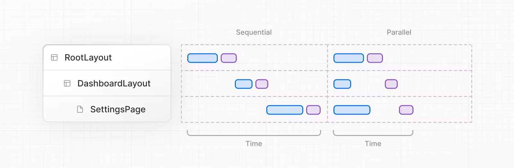
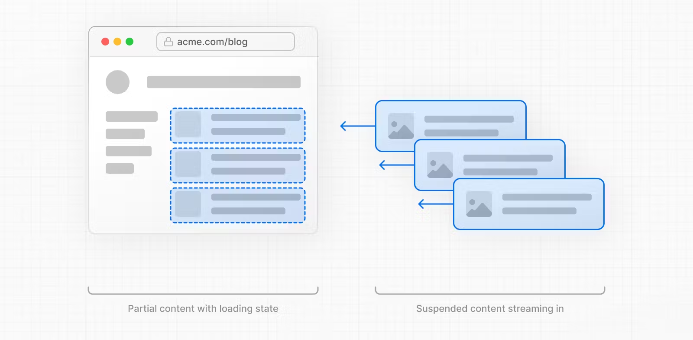
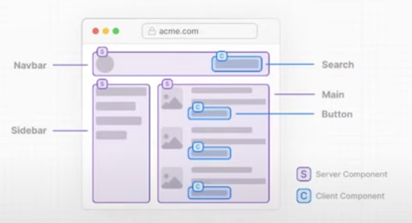
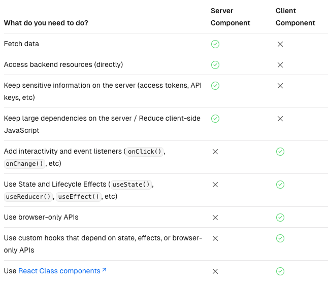

This is a [Next.js](https://nextjs.org/) project bootstrapped with [`create-next-app`](https://github.com/vercel/next.js/tree/canary/packages/create-next-app).

## Getting Started

First, run the development server:

```bash
npm run dev
# or
yarn dev
# or
pnpm dev
```

Open [http://localhost:3000](http://localhost:3000) with your browser to see the result.

You can start editing the page by modifying `app/page.js`. The page auto-updates as you edit the file.

This project uses [`next/font`](https://nextjs.org/docs/basic-features/font-optimization) to automatically optimize and load Inter, a custom Google Font.

## Learn More

To learn more about Next.js, take a look at the following resources:

- [Next.js Documentation](https://nextjs.org/docs) - learn about Next.js features and API.
- [Learn Next.js](https://nextjs.org/learn) - an interactive Next.js tutorial.

You can check out [the Next.js GitHub repository](https://github.com/vercel/next.js/) - your feedback and contributions are welcome!

## Deploy on Vercel

The easiest way to deploy your Next.js app is to use the [Vercel Platform](https://vercel.com/new?utm_medium=default-template&filter=next.js&utm_source=create-next-app&utm_campaign=create-next-app-readme) from the creators of Next.js.

Check out our [Next.js deployment documentation](https://nextjs.org/docs/deployment) for more details.

## Run the application

- Prerequisites

```bash
  npm install json-server -g
  json-server --watch --port 4000 ./_data/db.json
```

- Development mode

```bash
  npm run dev
```

- Production mode

```bash
  npm run build
  npm run start
```

## [Server Rendering Strategies](https://nextjs.org/docs/app/building-your-application/rendering/server-components#server-rendering-strategies)

- Static Rendering

Routes are rendered at **_build_** time, or in the background after data revalidation. The result is cached and can be pushed to a Content Delivery Network (CDN). This optimization allows you to share the result of the rendering work between users and server requests.

Static rendering is useful when a route has data that is **_not personalized_** to the user and can be known at build time, such as _a static blog post_ or _a product page_.

- Dynamic Rendering

Routes are rendered for each user at **_request_** time.

Dynamic rendering is useful when a route has data that is **_personalized_** to the user or has information that can **_only be known at request time_**, such as _cookies_ or _the URL's search params_.

- Streaming

Streaming enables **_progressively rendering UI from the server_**. Work is split into chunks and streamed to the client as it becomes ready. This allows the user to see parts of the page immediately, before the entire content has finished rendering.



Start streaming route segments using _loading.js_ and UI components with _React Suspense_.



## Client Component vs Server Component

Client component - Rendered on the server. Hydrated in the browser.

Server component - Rendered on the server. No hydration needed.



