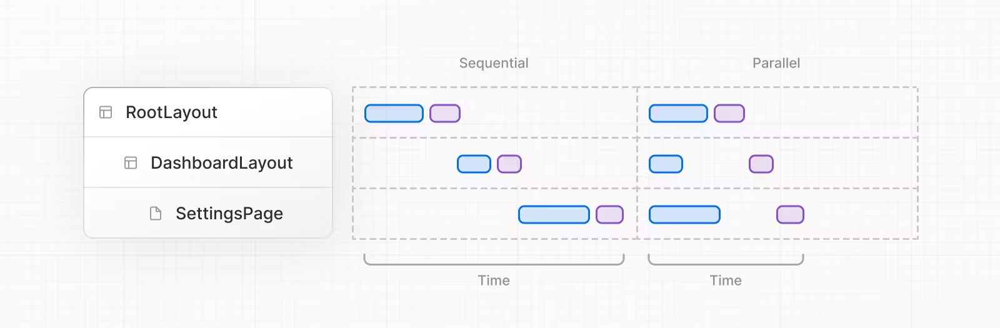
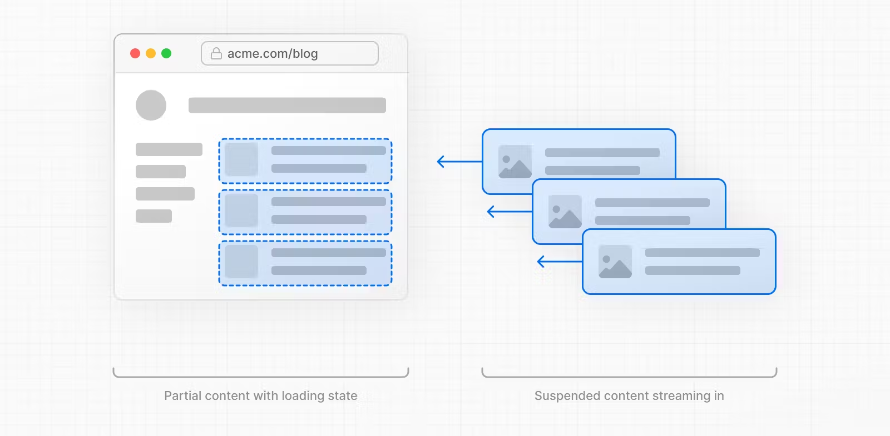
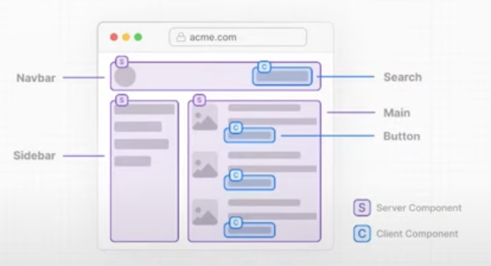
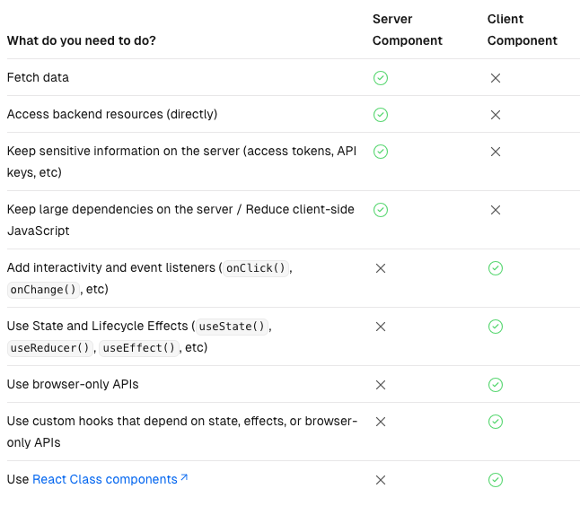

## Run The Application

- Prerequisites

```bash
  npm install json-server -g
  json-server --watch --port 4000 ./_data/db.json
```

- Development mode

```bash
  npm run dev
```

- Production mode

```bash
  npm run build
  npm run start
```

## Main Concepts

### Server Rendering Strategies [🔗](https://nextjs.org/docs/app/building-your-application/rendering/server-components#server-rendering-strategies)

- Static Rendering

Routes are rendered at **_build_** time, or in the background after data revalidation. The result is cached and can be pushed to a Content Delivery Network (CDN). This optimization allows you to share the result of the rendering work between users and server requests.

Static rendering is useful when a route has data that is **_not personalized_** to the user and can be known at build time, such as _a static blog post_ or _a product page_.

- Dynamic Rendering

Routes are rendered for each user at **_request_** time.

Dynamic rendering is useful when a route has data that is **_personalized_** to the user or has information that can **_only be known at request time_**, such as _cookies_ or _the URL's search params_.

- Streaming

Streaming enables **_progressively rendering UI from the server_**. Work is split into chunks and streamed to the client as it becomes ready. This allows the user to see parts of the page immediately, before the entire content has finished rendering.



Start streaming route segments using _loading.js_ and UI components with _React Suspense_.



### Client Component vs Server Component

Client component - Rendered on the server. Hydrated in the browser.

Server component - Rendered on the server. No hydration needed.




## Implementation

### TicketList page - Dynamic Rendering

Tickets should be constantly being updated and some of them could be very urgent, so opt out of data being cached at all. Set **_revalidate_** to **_zero_**, data never be cached and it always refresh.

```js
const res = await fetch('http://localhost:4000/tickets', {
  next: {
    // use 0 to opt out of using cache
    revalidate: 0,
  },
});
```

### TicketDetails page - Static Rendering

Ticket Details Page can be rendered in advance at build time into HTML pages and then distributed to a CDN and served up quickly when they are requested.

```js
const res = await fetch(`http://localhost:4000/tickets/${id}`, {
  next: {
    revalidate: 60,
  },
});
```

#### generateStaticParams

Using a function called _generateStaticParams_ to tell Next.js in advance all of the IDs, so that when we build the application, it knows all of the pages and routes that it needs to make and that way they can be statically rendered and served from a CDN.

```js
export async function generateStaticParams() {
  const res = await fetch(`http://localhost:4000/tickets`);
  const tickets = res.json();
  return tickets.map((ticket) => ({
    id: ticket.id,
  }));
}
```

### Suspense in TicketList page

You can pre-render loading indicators to provide a better user experience. The new content is automatically swapped in once rendering is complete. [Loading UI and Streaming](https://nextjs.org/docs/app/building-your-application/routing/loading-ui-and-streaming)

```js
<Suspense fallback={<Loading />}>
  <TicketList />
</Suspense>
```

### CreateForm Component - Client Component

Client Components allow you to write interactive UI that is prerendered on the server and can use client JavaScript to run in the browser. To use Client Components, you can add the React `use client` directive at the top of a file, above your imports.
